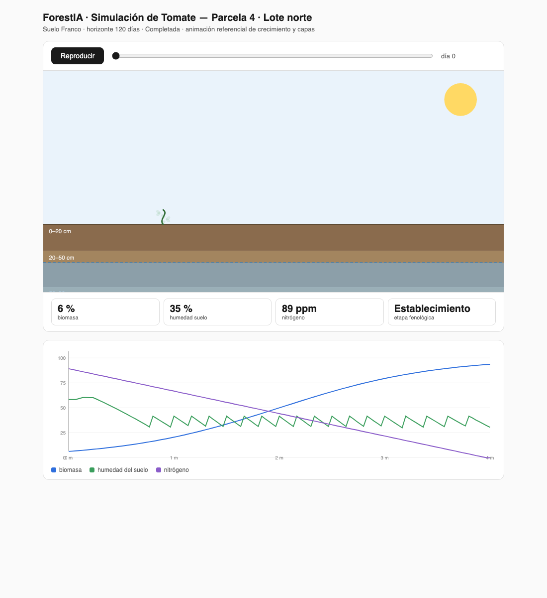
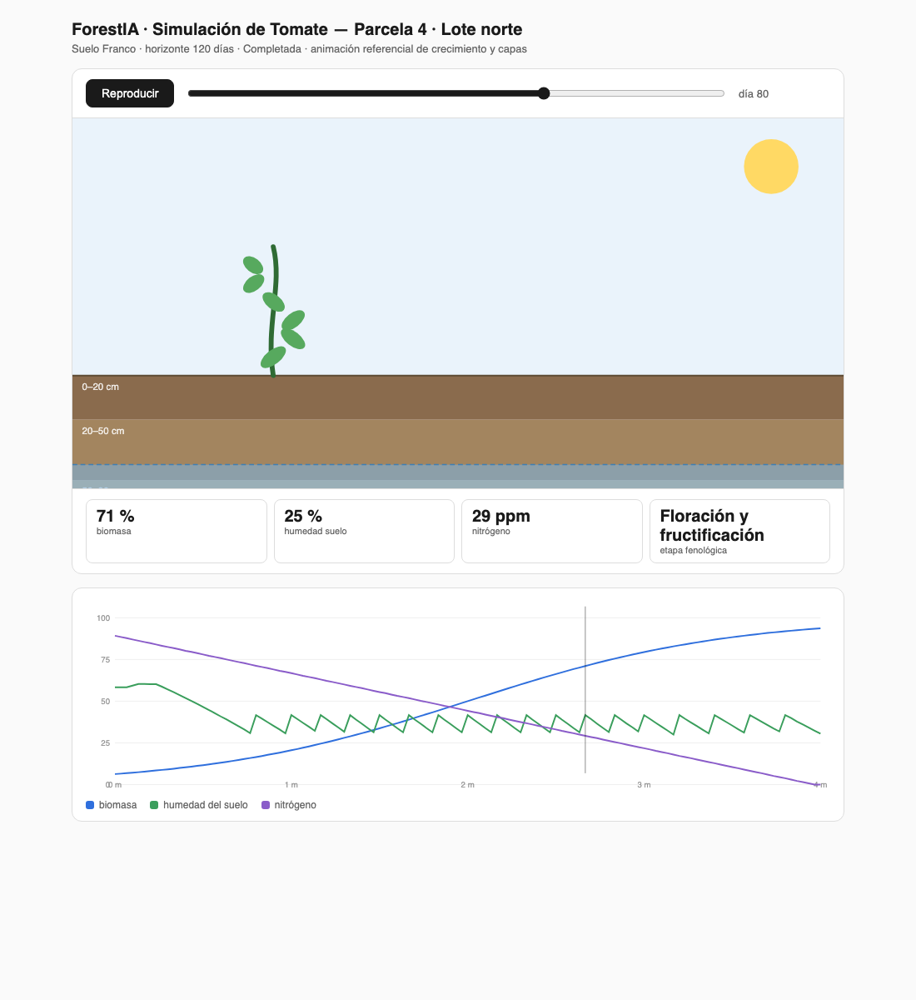

# ForestIA

Plataforma de simulaciones agrícolas: se cargan los datos de suelo (sustrato, humedad,
capa hídrica, clima, tipo de planta) y se genera una evolución predictiva (estadística)
de las plantas y de las capas que las contienen, considerando el consumo de nutrientes
de la especie cargada. Interfaz pensada para uso sin capacitación técnica.

## Stack

- **Django 5 + Django REST Framework** — backend y panel de administración
- **PostgreSQL/PostGIS** en producción (SQLite en desarrollo)
- **Celery + Redis** — simulaciones predictivas en segundo plano
- **Open-Meteo / OpenWeather** — datos climáticos
- **Sondas IoT LoRaWAN + drones multiespectrales** — telemetría de suelo

## Estructura

```
config/            settings, urls, Celery
apps/
  crops/           plantas y demandas nutricionales por etapa
  soils/           parcelas, perfiles edáficos y capas
  monitoring/      sondas, lecturas telemétricas y vuelos de drone
  weather/         registro climático + integración Open-Meteo
  simulation/      motor predictivo (biomasa, humedad, N) + tareas Celery
  alerts/          alertas agronómicas generadas por el modelo
fixtures/demo.json datos de ejemplo
```

## Arranque rápido

```bash
python -m venv .venv && source .venv/bin/activate
pip install -r requirements.txt

python manage.py migrate
python manage.py loaddata fixtures/demo.json
python manage.py createsuperuser

# Terminal 1: Django
python manage.py runserver

# Terminal 2: worker de Celery (necesita Redis corriendo)
celery -A config worker -l info

# Terminal 3: programador de tareas periódicas
celery -A config beat -l info
```

Tareas programadas (Celery Beat):
- **Clima**: sincroniza el pronóstico Open-Meteo de todas las parcelas cada 6 horas (minuto 17).
- **Re-simulación**: vuelve a correr la última simulación de cada parcela todos los días a las 05:23, con el pronóstico más reciente.

Panel de administración: http://127.0.0.1:8000/admin/
API REST: http://127.0.0.1:8000/api/v1/

## Flujo de uso

1. Cargar la parcela y su perfil de suelo (apps.soils).
2. Cargar la planta y sus etapas con demanda de nutrientes (apps.crops).
3. `python manage.py sync_weather` baja el pronóstico agro (ET0, lluvia, radiación) de Open-Meteo para las parcelas georreferenciadas.
4. POST a `/api/v1/simulation/runs/` con parcel, plant, horizonte y condiciones iniciales.
5. Celery ejecuta el modelo (`apps/simulation/engine.py`) con el pronóstico real (ET0 y lluvia de Open-Meteo) y guarda la serie en `result`.
6. El modelo genera alertas automáticas de riego y fertirrigación (apps.alerts).
7. La vista animada `/api/v1/simulation/runs/<id>/preview/` muestra la planta creciendo a tamaño referencial y las capas de suelo modificándose en el tiempo (botón Reproducir o parámetro `?day=80`).




## Variables de entorno (opcional)

```
SECRET_KEY=...
DEBUG=true
ALLOWED_HOSTS=127.0.0.1,localhost
CELERY_BROKER_URL=redis://localhost:6379/0
CELERY_RESULT_BACKEND=redis://localhost:6379/1
```

## Próximos pasos planificados

- Migrar geometrías a PostGIS (PointField/PolygonField)
- Ingestión MQTT para sondas LoRaWAN
- Dashboard front-end conectado a la API
- Calibración del modelo con datos reales de laboratorio
